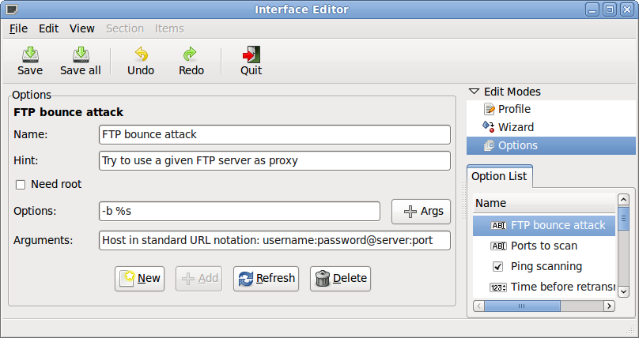
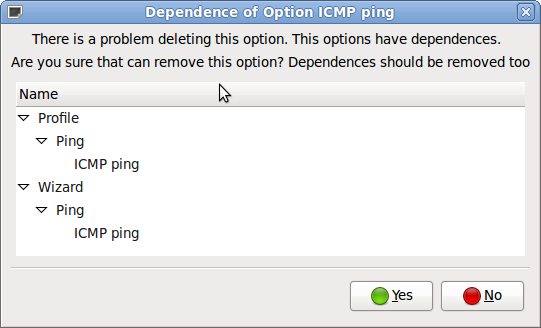
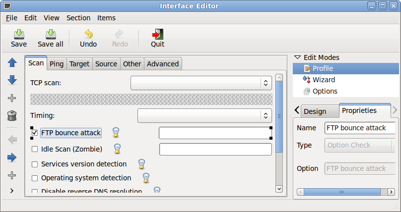

Interface Editor
================

.. sectionauthor:: Luís A. Bastião Silva
.. moduleauthor:: Luís A. Bastião Silva

.. warning::

   This documentation is not finished! Part or all of it's content may be
   missing or inaccurate. As Umit Network Scanner is under constant development
   and improvement, expect changes in this documentation at upcoming releases.

Introduction
------------

Interface Editor is a customizer of Profile Editor and Wizard, so end user 
should be able to add, edit and remove **Nmap** options.

Profile Editor and Wizard are using XML files to load his options. Interface 
Editor management this XMLs and show a graphical interface to handle it 
in run-time.

What does it do?
^^^^^^^^^^^^^^^^

* Add new Nmap Options 
* Edit Nmap Options 
* Remove Nmap Otions
* Customize the profiles (Create new tabs, organize options, etc)
* Rollback changes throught a Undo/Redo stack

Using Interface Editor
----------------------

Interface Editor can be opened using:

1. **Use the key-stroke**

   * The key-stroke that open Interface Editor is CTRL + N

2. **Access from the Main Menu**

   * Go to the *Main Menu* (the one on the top of the application)
     :menuselection:`Profile --> Interface Editor`

Once Interface Editor is opened it have three modes of editing:

* Options 
  
   In this mode user can add new options, remove and edit options 

* Profile 

    Editing organize of Options in Profile Editor

* Wizard 

   Editing organize of Options in Profile Editor

Options Mode
------------

The options is the part of create, edit and remove Nmap options. Furthermore
options added there will be available on Profile and Wizard mode.

.. _ieditormain:

   Interface Editor - Options Mode
   

As you can see in :ref:`Options Mode <ieditormain>` in the main frame (Options) you're able to add, edit or remove options.

A new options have this parameters

* Name

   Name of Option 

* Hint

   Description of Option

* Need Root 
   
   If "Need Root" is able this option will be not considered if Umit Network
   Scanner is running without Administrator level.

* Options + Args 

   The options is the real option of Nmap like: `-b -oX -A -6 -p21` and others.
   In some cases some arguments of **Nmap** can be mixed with arguments
   An argument can be:

   - Level ( Increate a number ) 
   - Integer
   - Float
   - String
   - Interface ( Option list) 
   - Chooser Path (Something to choose a file)
   

* Arguments

   The description of input parameters of Nmap introduced in "Args" button

If you add a new option or delete it will be added to Undo/Redo stack and you 
can easier rollback changes.
   
   
Remove options
^^^^^^^^^^^^^^

If a user can remove an option it can be done, just selecting the option in the 
list and then press in "Delete" button.

.. _ieditorremoveoption:

   Interface Editor - Remove Option with Dependence

In :ref:`Remove Option <ieditorremoveoption>` there is dependence in Profile and
Wizard. If you remove the option it will removed also from Profile Editor and Wizard.

Profile Mode
------------

Profile Mode is able to customize the `ProfileEditor`.

.. _ieditorprofile:

   Interface Editor - Profile Mode

The :ref:`Profile Mode <ieditorprofile>` have all the options of Profile Editor
with the same prespective.

In the right side you have a list of all options that exists: **Option List**. 
If you intend to insert you need to create a space for them.
A **voidplace** is a spot when you can insert new option.
It can be inserted by "Items" menu or by the toolbar in left side.

If you remove an option (just selecting, and press "Delele" or throught the 
tooolbar/menu) automatically you get a voidplace. Then user will be able to
exchange the option.

In each option user can put the option up or down from the others just using 
menu "Items" or using the left toolbar.

*Sections*

What user can do:

* Add new section

* Rename a existent section

* Remove section 

* Move to left/right sections 

* Add/Remove all options in each section

All changes in this mode will be added to Undo/Redo stack.

Wizard Mode
-----------

Wizard Mode works in the same way of Profile.
The prespective is different from the Wizard GUI. The most left section will 
be the first one appearing in Wizard, and the most right will be the last.

Configuration Files
-------------------

Option Mode use: `options.xml`

Profile Mode use: `profile_editor.xml`

Wizard Mode use `wizard.xml`
