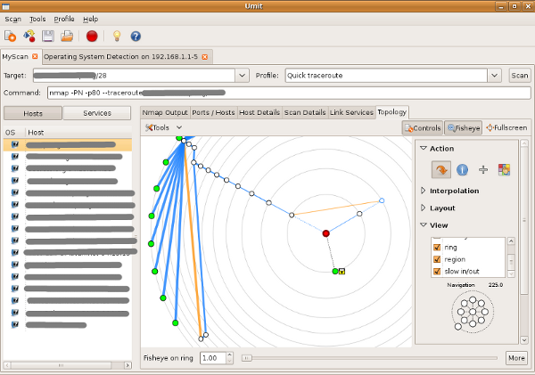
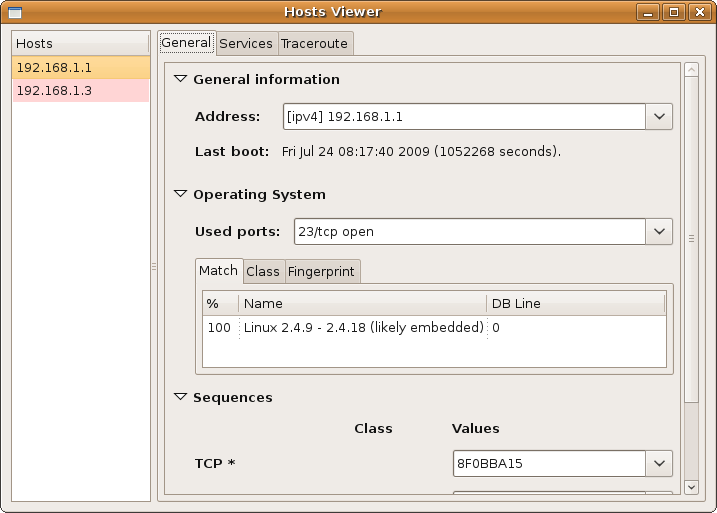

Network Topology - RadialNet
============================

.. sectionauthor:: João Paulo S. Medeiros
.. sectionauthor:: Luís A. Bastião Silva

.. moduleauthor:: João Paulo S. Medeiros

.. warning::

   This documentation is not finished! Part or all of it's content may be
   missing or inaccurate. As Umit is under constant development and
   improvement, expect changes in this documentation at upcoming releases.

Introduction
------------

**Umit Network Scanner** is able to discovering new hosts based on *Nmap*.
Topology is a network visualizer able to show a great networks with a large
number of nodes connected, even in different networks handy throught a easier interface.
Besides the interface is ready for everyone navigate in topology network.

What does it do?
^^^^^^^^^^^^^^^^

* Visualization of network topology with Nmap XML as input.

* Interactive exploration of network through visualization.

* Complete viewer of mapped services and NSE output. # XXX ??

* Complete viewer for OS fingerprint output.

* Complete viewer of traceroute information. 

Visualization - Topology Graph
------------------------------

The network topology was designed based on mathematical theories that was quick overview below.
The visualization can show so much information. Sometimes it is needed to hide some of these information to keep the visualization clean.

It offer a user-friendly interface like you can see on
:ref:`Topology Interface <topology>`.

.. _topology:

   Topology Interface

Animation
^^^^^^^^^

You can change the center of visualization by clicking on a node.
You can change the method of interpolation between polar or Cartesian.
The first method minimizes overlapping in the animation, but the second is
cleaner for some people.
If the animation is to slow you can decrease the number of frames on the top
right-hand side of the control panel.
You can also change the coordinate system being used to do the interpolation
(polar or Cartesian).

Node's placement
^^^^^^^^^^^^^^^^

Two options for a node's placement can be used, Symmetric and Weighted.
The first method is easier to view because it better shows the network
hierarchy, but the second uses available space much better.

Grouping
^^^^^^^^

You can group nodes selecting the 'Group node' option on the top toolbar.
The children (only blue line connections) of a node are grouped with it.

Toolbar
^^^^^^^

The network can be easier management by the user through a could of actions :ref:`RadialNet Actions <toolbar>`:

 * Actions
 * Interpolation
 * Layout
 * View

.. _toolbar:
.. figure:: static/radialnet/toolbar.png
   :align: left

   RadialNet Actions

**Actions**   
   
There is some actions to the left click that user can provide in each node:
 * Change Focus 
   Each node that user click will be the center of topology
 * Show Information
   It will show information of the node using Host Viewer
 * Group children
   Each node is group the networks reached by it # XXX FIX ME - TO DO
 * Fill region
   It fill the region of other nodes in next radials # XXX FIX ME 
   There are tree colours that can be used: red, green and yellow
   
**Interpolation**

Radial system is able to use polar and Cartesian coordinates. In some kind of
animations use polar coordinates increase the performance.
It also is able to customize the frame number of each animation when you click
in a node.

TODO: Talk about animation time (?), frames?

**Layout**

Radial can be showed using two methods:

* Symmetric
* Weighted 

If you prefer see the hierarchy level use Symmetric (in this methods some nodes
can be overlapping).
If the user can prefer see all nodes should use Weighted.

**View**

Fisheye visualization technique
^^^^^^^^^^^^^^^^^^^^^^^^^^^^^^^

Sometimes you may wish to focus some regions of the map. To make this possible a fisheye mechanism was implemented. 

Symbols
-------

Icons
^^^^^

Each device is identified by a specific icon representing:

+-------------------------------------------+----------------------------------+
| Symbol                                    |  Meaning                         |
+===========================================+==================================+
| .. image:: static/radialnet/wireless.png  |  Access Point - Wireleess        |
+-------------------------------------------+----------------------------------+
| .. image:: static/radialnet/firewall.png  |  the host is a firewall          |
+-------------------------------------------+----------------------------------+
| .. image:: static/radialnet/router.png    |  the host is a router            |
+-------------------------------------------+----------------------------------+
| .. image:: static/radialnet/switch.png    |  the host is a switch            |
+-------------------------------------------+----------------------------------+
| .. image:: static/radialnet/padlock.png   |  the host has filtered port      |
+-------------------------------------------+----------------------------------+

It use also squares to easily distinguish devices like routers, switches 
and wireless access points from general purpose hosts. 

It assume a vulnerabilities level of nodes.

+-------------------------------------------+-----------------------------------+
| Symbol                                    |  Meaning                          |
+===========================================+===================================+
| .. image:: static/radialnet/host_g.png    |  Less than 3 ports opened         |
+-------------------------------------------+-----------------------------------+
| .. image:: static/radialnet/host_y.png    |  Between 3 ports and 6 opened     |
+-------------------------------------------+-----------------------------------+
| .. image:: static/radialnet/host_r.png    |  More then 6 ports opened         |
+-------------------------------------------+-----------------------------------+
| .. image:: static/radialnet/host_sq.png   |  Routers, Switches or Wireless AP |
+-------------------------------------------+-----------------------------------+

Lines
^^^^^

TODO: I'm not feeling comfortable enought to write it 

Host Viewers
------------

:ref:`Host Viewers <hostviewers>` is a interface to show information about
hosts

 * General information (Address, Operation System, Sequences, etc)
 * Services (Ports and info about services running)
 * Traceroute information for design network topology

.. _hostviewers:

   Host Viewers
   
:ref:`Host Viewers <hostviewers>` can be reached also through the right click
in each node showing specific information about the node selected.

Save Network Topology
---------------------

This feature allow you export the topology for a file and it become easier life
of user to include network topology of network in articles, reports, etc.

There are some formats able to export:
 * PDF
 * PNG
 * PS
 * SVG 

Some examples of Profiles and scans
-----------------------------------

In the case to see topology of a network in the Internet you should use the 
``--traceroute`` option, that can be found in Profile Editor.
You also can use the profile "Quick Traceroute".

If you're willing to make a scan over a network designing the topology the user
should also provide the target like network_address/mask, ie. 192.168.1.0/16.
