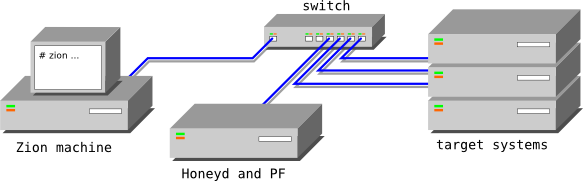

Zion
====

.. sectionauthor:: João Paulo S. Medeiros

.. moduleauthor:: João Paulo S. Medeiros

.. warning::

   This documentation is not finished! Part or all of it's content may be
   missing or inaccurate. As Umit is under constant development and
   improvement, expect changes in this documentation at upcoming releases.

Introduction
------------

Zion [#zion]_ was introduced in Umit in Google Summer of Code 2009.
Its goal is identify networks devices and systems in a remotely manner.
Some examples of these devices and systems are: SYN proxies, Honeyd, Firewalls
and Operating Systems in general.
For instance, consider the testbed presented in :ref:`Zion testbed <testbed>`.

.. _testbed:

   *Zion testbed*

Notes and references
--------------------

.. [#zion] The name Zion is an acronym which means *systematiZed Identification
   Over Network*, and is related to Matrix last human city on the planet Earth.
